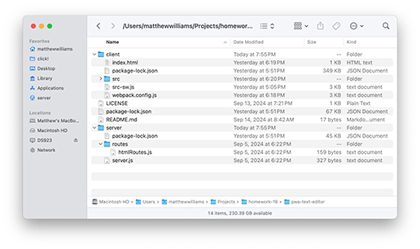

# J.A.T.E PWA Text Editor

## License

MIT License

## Description 
This repo includes code for J.A.T.E., an online text editor that can also be installed as a PWA. Data input into J.A.T.E.is stored in an indexeddb using the idb wrapper. The PWA functionality relies on Babel and webpack.

## Table of Contents
- [Installation](#installation)
- [Usage](#usage)
- [License](#license)
- [Contributing](#contributing)
- [Acknowledgments](#acknowledgments)
- [Tests](#tests)
- [Questions](#questions)

## Installation
J.A.T.E. is hosted like any website—Render in this case. To install and launch the app's server and to compile the client and serve its HTML to a browser, type "npm i" in the root folder and again in the client and server folders to install all dependencies. Then type "npm run start" from the root folder. In addition to launching the server and serving HTML to the browser, "npm run start" will invoke webpack to compile the site and all dependent files into a "dist" folder and will register the service workers that will be required by the PWA. The HTML page will be served from the dist foder.

To install the PWA, simply click on the Install button in the web-page header. Once installed, you will be unable to reinstall the J.A.T.E. PWA on the same device until you use the uninstall function available in the more-options button (the vertical ellipsis) in the upper righthand corner of the PWA.
 
As with most apps, the folder structure in the repo is important and should be followed carefully. Both client and server files are required. See the image below for the folder structure.

## Usage
J.A.T.E is very easy to use. Simply type your text into the interface, and then change focus to write your entry into the database. You can close the app, and when you relaunch, you will see that your data has persisted.

## Contributing
To contribute to the J.A.T.E Text Editor, clone this repository locally and commit your code to a separate branch.

## Acknowledgments
This code relied heavily on project code used in a mini-project activity that the class worked on together and on ChatGPT for code checking and clarification. While I did adapt much of the code for my app, I worked very hard to understand what the code was doing. Most of the comments in the code explaining what different statements do would not have been possible without ChatGPT's clear explanation of concepts that were covered quickly in class and were difficult to retain.

## Tests
If you are making core library changes, please write unit tests for your code and ensure that everything is working correctly before opening a pull request.

## Questions
You can see my github repositories at [MatthewWilliamsCMH](https://github.com/MatthewWilliamsCMH/).  
Drop me a line at [matthewwilliamscmh@icloud.com](mailto:matthewwilliamscmh@icloud.com).